

    <a href="https://hermes.fractum.nl">
        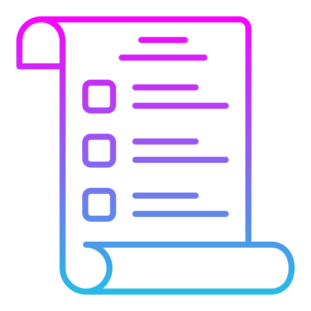
    </a>
    <h1>Hermes</h1>
    
<i>Shopping list and expenses tracker*</i>

    
*Expenses tracker not included (coming soon™️)

<!-- TOC -->

    
Table of Contents

    <ol>
        <li>
          <a href="#features">Features</a>
        </li>
        <li>
          <a href="#technologies">Technologies</a>
          <ul>
            <li><a href="#language">Language</a></li>
            <li><a href="#framework">Framework</a></li>
            <li><a href="#styling--components">Styling & Components</a></li>
            <li><a href="#secured-by">Secured by</a></li>
            <li><a href="#database">Database</a></li>
            <li><a href="#hosted-on">Hosted on</a></li>
          </ul>
        </li>
        <li>
          <a href="#screenshots">Screenshots</a>
          <ul>
            <li><a href="#workspaces">Workspaces</a></li>
            <li><a href="#workspace-overview">Workspace overview</a></li>
            <li><a href="#lists">Lists</a></li>
            <li><a href="#invites">Invites</a></li>
            <li><a href="#profile">Profile</a></li>
            <li><a href="#view-transitions">View transitions</a></li>
          </ul>
        </li>
      </ol>

<!-- TOC -->

## About the project

Hermes is a shopping list app that allows you to create different workspaces for different households. You can then
create multiple lists inside these workspaces. This allows you to have a list for your weekly groceries, and a list for
your monthly groceries, for example.

It was created as a successor to my [other shopping list app](https://github.com/robinheidenis/shoppinglist), which in
turn is a successor for the first ever real project I did together with my brother.

My goal for the project is to create a fully functional, production-ready app that I can use in my daily life.
I also wanted to focus on the UX of the app, which is why I spent a lot of time on user flows and little niceties within
the app.

## Features

- [x] Different workspaces for different households
- [x] Multiple lists per workspace
- [x] Join workspaces with an invite code
- [x] Loyalty cards
- [x] Dark mode
- [x] Swipe to check and delete items
- [x] Cutting edge new features (View transitions)
- [ ] Expenses tracker
- [ ] Bugs (hopefully)

## Technologies

Created using
the [![T3 Stack](https://img.shields.io/badge/Stack-%23000.svg?style=for-the-badge&logo=data:image/svg+xml;base64,PHN2ZyB3aWR0aD0iMjU4IiBoZWlnaHQ9IjE5OSIgdmlld0JveD0iMCAwIDI1OCAxOTkiIGZpbGw9Im5vbmUiIHhtbG5zPSJodHRwOi8vd3d3LnczLm9yZy8yMDAwL3N2ZyI+CjxwYXRoIGZpbGwtcnVsZT0iZXZlbm9kZCIgY2xpcC1ydWxlPSJldmVub2RkIiBkPSJNMTY1LjczNSAyNS4wNzAxTDE4OC45NDcgMC45NzI0MTJIMC40NjU5OTRWMjUuMDcwMUgxNjUuNzM1WiIgZmlsbD0iI2UyZThmMCIvPgo8cGF0aCBkPSJNMTYzLjk4MSA5Ni4zMjM5TDI1NC4wMjIgMy42ODMxNEwyMjEuMjA2IDMuNjgyOTVMMTQ1LjYxNyA4MC43NjA5TDE2My45ODEgOTYuMzIzOVoiIGZpbGw9IiNlMmU4ZjAiLz4KPHBhdGggZD0iTTIzMy42NTggMTMxLjQxOEMyMzMuNjU4IDE1NS4wNzUgMjE0LjQ4IDE3NC4yNTQgMTkwLjgyMyAxNzQuMjU0QzE3MS43MTUgMTc0LjI1NCAxNTUuNTEzIDE2MS43MzggMTUwIDE0NC40MzlMMTQ2LjYyNSAxMzMuODQ4TDEyNy4zMjkgMTUzLjE0M0wxMjkuMDkyIDE1Ny4zMzZDMTM5LjIxNSAxODEuNDIxIDE2My4wMzQgMTk4LjM1NCAxOTAuODIzIDE5OC4zNTRDMjI3Ljc5MSAxOTguMzU0IDI1Ny43NTkgMTY4LjM4NiAyNTcuNzU5IDEzMS40MThDMjU3Ljc1OSAxMDYuOTM3IDI0NC4zOTkgODUuNzM5NiAyMjQuOTU2IDc0LjA5MDVMMjIwLjM5NSA3MS4zNTgyTDIwMi43MjcgODkuMjUyOEwyMTAuNzg4IDkzLjUwODNDMjI0LjQwMyAxMDAuNjk2IDIzMy42NTggMTE0Ljk4MSAyMzMuNjU4IDEzMS40MThaIiBmaWxsPSIjZTJlOGYwIi8+CjxwYXRoIGZpbGwtcnVsZT0iZXZlbm9kZCIgY2xpcC1ydWxlPSJldmVub2RkIiBkPSJNODguMjYyNSAxOTIuNjY5TDg4LjI2MjYgNDUuNjQ1OUg2NC4xNjQ4TDY0LjE2NDggMTkyLjY2OUg4OC4yNjI1WiIgZmlsbD0iI2UyZThmMCIvPgo8L3N2Zz4K)](https://create.t3.gg/)

The project uses the following technologies:

#### Language:

#### Framework:

  
  

#### Styling & Components:

  

#### Secured by:

Currently:  
[![Lucia](https://img.shields.io/badge/Lucia-%237357ff.svg?style=for-the-badge&logo=data:image/png;base64,iVBORw0KGgoAAAANSUhEUgAAAMgAAADICAIAAAAiOjnJAAAaOElEQVR4nOxd+XcTR7b+ZHZCJpmQACHAhDCBYMzijS0EMgyzvOVvez/MvNk4hJCQGSaEzLwMyQABDHi3seUV78a78Y43LC+S+h211FK3uqq7qqWWuqX6Ts6hVCnfqlZ/uver21XV6yVJgoBAspGT7gEIZCYEsQRsgSCWgC0QxBKwBYJYArZAEEvAFghiCdgCQSwBWyCIJWALBLE4EBQPKZghiMWK8Xl4h9I9CPdAEIsVJd140JnuQbgHglhMWFpF7QB6pzD0Mt1DcQkEsZjgHcLCMiQJpb3pHopLIIjFhEddgKzcq/tC3kvAFIJY5phYwMCMXJLgW0Xri3QPyA0QxDLHv1vgUSUa/t2azsG4BYJYJvCtoWk4VAhxS6bX8CyGhYQ3gyCWCRoGsbgSoZRHoVdZT7qH5XgIYhkhKOFRNHclxegVkvAraR2Z4yGIZYSBafRPxSgFhV7htJaAAQSxjPC4U0spxMql3ekZklsgiEWFbw3V4XRo1GOpXNfQDEZm0zg6p0MQi4qKbgSDJI+l0OuuyDvQIYhFRlBC7XPlA8ljQULziMjCUyGIRUbnC/RNxuuqWEEuL62gtCsto3MBBLHIILgrfRmo7YNY/EeEIBYBy2uo6o6l2kGjlxSS8L0TaRqlsyGIRUBZpyzbVan2CHQeC8DjjnQM0fEQxIqHBJR1KCX1kxx1C8Qa1PbBJyS8DoJY8egcxdgswTPRXJckCQlPgCBWPGqjD5h1NKJFxpjSF1AgiKXBzCKqunSJK20SS0+vwWk0iw08WghiaeDtQyCofDBMYnm0AfFpXyqH6QIIYsUQBO40yCXjLANUrksp1/QKCa+BIFYMHUNY8CkfzLIMcZFRkkTeQQNBrBgqw2v6mCkFLb2qxEIaFQSxIhifhfe5eardoMHYHLz9KR2zkyGIFUH985Bs99C8FJvwqhHbWRUIYkXwqDnCEk/cjM/0iaGq3DiAqYWUD92REMQKoX0Y80vKhzh6qSpNy5KEOpF3kCGIFcI9r/yPLvARIqNZlLzXbPtoXQFBLEzOoWtU+aCjUbzrMnNjr5bRKCS8IBaAuh4EAibBzmT9jLZcLbazCmKtrKGkiZUxJpFRKTf0y+sjshvZTqyOqGw31U8gzRlJjSUJtVmfd8h2Yt2r50ivg3nO+KQtJaN3MLKaWJNz6NXLdmYtZSC8Fnxoyu49+FlNrLLwjlNejwVNmSa8Hmb3dtbsJdbKGmraQy7HE/7M7rF0q/+IwqtrNKslfPYSq7EHc6/kUpQZljwWKMIrGMxqpZW9xCpvJWUTEnsIHZeSqO0O+cXsRJYSa3oe3SNyScsMamTk0fVR17Xgw7NsXQufpcS699SQGZIuMnJFSVVkvNdo30U4GtlIrNW1kMCKgMHx8Iotdbl/AuNZKeGzkVgNPZh/xS/JOZOo0fKTZ3ZdiJORjcSqbKEnEUAuc8wZdfyr68lGCZ91xBqaQGdYUHM6ofU5eGsbH6XClXNLeJp96x2yjljlzWyUQny5+CB+XcgsvLSVFe12XIqjkV3EWvOjopktrukqT32E/APYkANqxoseUp+PYWLO5mtzGLKLWNWtkTV9RswgcW7fDhzehze34dThSD1fSgK412DXRTkT2UWsp9GQRMyF0plRfChSjBbAlZKQ0Pgcq/6kX5BzkUXE6hpE95AuWcUw41uXg/PHIhWH9uC97fGBz4heSmHRhyfZtN4hi4hV30Flj3FkLDqITRtids4eUbVRNTYVXvXZNDfMFmKFZHuTXKKEKoPIeLFAY+r8Uaxfp2rA/Cyobwx940m8JkcjW4hV1axsxQmDMonT02vfDuzdoTG1YX1ohmigqwwiY3nWZOGzhVhl0YfBDJM4Nb2KDiHHE28tJuENH0LrG1R1ZIuEzwpi9QxieNwk1aQve4DXt+DCcYLBj/bh57vN55J6/xcIoDQ7JHxWEKtOnfjmWaqQ9wE2bSTbLDhoaE0fGZXG9dlxjFbmE2tuEZWNDF6KVPmfZ6hmzx9TJDyb5ajwev4C7YNJvUJHIvOJ1dwFv5871R6W7e+8STW7fp2chedcqhUeRl0WOK3MJ9bdCvkfSfV2CbZ1DZ+cMLEckV/M/i86jOp2rAUSuyrHI8OJ1dWPl3Ox++qJo1e0oCu/8RoKPzIxvm8nDu7RWWMQXoEAnjRZvSSXIMOJVRU9rUrS0ktXGVc+cQhbNpnbP3OESb/HoJQrM31nWCYT6+U86lupgY8aGcPZ9kKmLgo/wk+2WpkZjE6jNaOP0cpkYtW1hmR7BKQbT46MwN4d2PEWUxcb1+PYAYaZAYleVRnttDKZWI+fyv+YhaoYvZTK357l6OU/TsPoUSNd0jX14mXmnoSbscTqHsDL6L4rhlR7lBmvb0Xufo6Otr+BA+9FrHGt/vMHMjlZmrHEelAp/8MjqMPMKPgImxlkuxpnj2qNELsjRcYH9XwduQiZSayXc+jo5RbUANbl4BdF3N0VH8Ybr8UTlIVes4toy1AJn5nE8j7DWli2syXEo+UP9mDndu7uNqxH0WGCNRZ6ZaqEz0Bi+f14XKO6qWyPisO4eNJip58WUBlMOCNJVW7oxlQmbuDJQGJ19WHmpVySVEc5MiiebVtw/JDFTt9+Ex/s1sVZ7UNoYtf+AJ5m4vvoMpBYD6OyXYbmHfSGHutcQUL9/uoU1TIMI2NGPt7JNGLNzaOjh+Cl4nOhetnuwcmjCXWduz9ewhOdpZ5eswtoz7iTcDONWKW1SomSrKIpoSMfYtfbCXW9cQPO5xMs64ehF14P6hLq2oHIKGIFAnhq9poJWmQ8fSwJAyjORU4OtWvoeBblVucQZuaTMADnIKOI5W3F9IxcMruvcZHxtS04djgJA3jnpzi4ly9/Fo6Mfj9KvEkYgHOQUcSqNX4Hva4ySq+Lp5L2RfzyJKlrw2GE6eXtxGoGHaOVOcSaW0Bbl/KBbY1oGOs8KE5GHAwj7wBe32plGC/n0ZlBa+Ezh1gPy+R/GIRz3M0+8iHe/mkyR3KhwMowANx/msxhpBcZQqxAAN5msogxDUknSTsHE0FRLtblMA9DNebuDJLwGUKsxlbMzjHnQlX38p23kH8kyYPZuR35h5jXOGhZ/jhTJHyGEKvWS09WGd7Lk8eh20CfBJzMg+nqZ5CiZH2H8vjc5cgEYo2O4VmnXIpLVpl5rBwPLvIsFmXH0Q+xTZbwtNXPtLHNzKEuIx4dZgKxavQvs9TnQkn39Xgu95o+dlw6RUqbMXjTmow43MH1xAoEUFqlfKDkQmn3MumyXY3CXPmYGhWbGSNj5wBm3b8W3vXEqqnH2qqRPKdFxj3vIs/qIhkWbH8Tp45px2P8LFxVeafKxoGlBq4nVn0jqy6Oo1d+nvJczzYU5pLHZrohu7HL9RLe3cTqG0BneKMLc447TK8cDz6lnySTLOQekFdMGOwLogiv+UVUunyRlruJ5W3ioJS6ga2yXY1Tx4yGYSC86l0+N3QxsQIBVFYrHzjzor/4OEWD/LRY8z5f9sjYPYiRiRQN0g64mFi1dVhd4fBS0fLuXdi/L0WD3LRRWZhqNk59ZCx188ssXEysCnnqRH2ZIP1eFh6zXbarUZxHHoZpZKxqgt+1x2i5lVj9gxgYjNweT9yMT7dDJgK5vGUzztuTbach9+f42btMATqMqOta87tYwruVWA0N5BmfqZbPPRjiVopRcCR+GKbjDNPL69r30bmSWIuLKKcczRA7vB/kBr+5mPrx4lwhPB7VMKArUzjX1Y8ed74H35XEamk1lO30h9C73w39l3ps2SRLeHqANijXufNlFq4k1v0HSsnw16+PjB+fSuEotfikKDaMWIFhGlvd7EoJ7z5i9fdjcpL1169+rc3WLShOYK9zWxd+fGL9z/fvxfu7mT2Wav6xuoqKRuv9pgvuI1ZllYnspdGr8ESIW9YwNoHrN/HDfbRaTYh7gI8LDde4glqucOGyUpcRa2FBng/yB5SQgrb6cNDvx+XrWHiFQABf3sTktEU7hXnYKk9IyRuy6RcyMoEet23gcRmx6uqw7FM+8ORF392J93Zb6TEYDLFqQgm+Sz784Sp8PiumNm/C0UOk6YVZZJSCKHPb2X8uI1Z5uflLconlX/3SYo93S9CmfTXr1DSu3woRzgJ+/YkyJBnsJ+E0dWJ+0eIlpAVuItbAACbH4yV5BIb02rIFR3Kt9FjXiH//SLDc/Azf3bVicNc72Lc73hrL6r/V1RC3XAQ3EevhfaUUjSZs+cZ8S7J9ZBTXv6ZaflgaopcFfFxIHqfp6r8fK6x0ly64hlivFtHexpSs0v/iz/E/HFxYxOUvEPAbWf7iawwOc1suPCqznHN5FiRMz+K5e7LwriFWbS1WluWSYbJKXR8u7N+PvXv4+goGcfU6pqd11rSWV1bw2V8xz7nxYctm1SYOw4fQ+q5L3XOMljuIFQigMno0A0VL0d5Bf/4cd3f/+Be6e8nW4srTM7j6VwQlPvvniqhaypheje2YdckefHcQq6cb42Oqz5QftP584s2bUJDP11dFNZ6UcaSaevpw8598Xby7E3t2mVvWZ7xW11DbwtdXuuAOYpU+kv9hexKijowfn+Vb09fXj2++Jak3w67La1BRw3dFvzpveCFaEal2XeUuSWi5gFivXqG12fzHTRRehWxvhwtjYRF/uRIKu9Bz1KA7ufzNd3xCPu8Qtm5ishxGNDJOzaCPf8aQeriAWE9KILFlqOMqjxzB3r2svfh8uHwlRGL9PaaeBKF6VOz348/XOJ72bN6EC2fNLoSk6yHhbilrL2mE04kVCKCxjoFSJL/C5a5u3kK/+rU2LHkNbeP5eVz9CiurrD0W5Ml78A0uhDKMrj7MOX4PvtOJ1dKI8ReG72qjhKrNmzmI9bAEdfXxFogTT2PhNTSCG7dYO929Ewd+ZvLbIJTlhTSPq1l7SRecTqz68LntxskqUvmT8/CwXVxPD25/z+EUjYVXXQOeVLJe3YUzGsumXUcrG9qcvgff0cRaWkJLg8Y9sNPrJNti0akpXPlMzrAbWuOKjP+8jWdsy7aO50YW0ph0rXOQk9Poc/ZCGkcT68EdnWw3yIWqyrlHsHOnuX2fD3/8oyzYeSgFs8jo94fE1uSU+QBycnDhNPMRhNpeHC7hnUusYADeWqqWMn5XWyHDyywlCX/7G6YmrVBK3YAYGVdWcPkallfMh1FwDB4PaeKpv2ptL53PHS3hnUuslka8DM/e2XKh0QZvbUdhsbn9f32Hpgaz8MrsP/TMeDEW8lt+MyW0e5f8Ugy9EYaunzhYwjuXWPU1rPc1LjIWFJhn21uatYtweF4Szi682tpx76H5lRYe11gz3hepLje2mRM3XXAosSbH0RzdQcCQ41G/q+2XvzExPjqCL68RLJvPDEhdU4WXjDv30dBsMp4TecqZSnT/RxzG+CSanXrakUOJVVMOKciteDzA8RN47TUjy/Pz+OyyvAKHYjmhyAgCM74yW7aVk4NL58n+j3w4r6q7SqcupHEisYJBlJXwUSp644sMswyShGufYXKC8Id6ehHqmYehjowry/j8uomQLzoh78EnWTOeM3b0YMGRa+GdSKyGWiwvySVOV7FzF46eMLJ862v0dCl/CJURkjWPXngxeyxo/d/kFP58xUgPvb09ND2kWTOIjJKEHx2Zd3AisbzVlFWUZvc1v9hItleWo+wxN1n5Mv6UBh6g9zm+/c7oqotPmPs/Ir0anjlxD77jiDUygDblUKiYzzC4bSp88inV7PAgbt1QfbbkeCxQSl0ur0QtXRIdPoS339JdFE14qepfzqLOeXvwHUes+mpFtodBf/k7tJV5x7HtdbLNmWn85X+VnRGJOR6WI7io1Jfw1d/xvI88yHXrcKqI1Vrc6r9a553P5ixiBYOoeqx80CmeWD2pwQXKltTVFXx1FfOzMJHkzCwxEV6G1qQgvvybapuGFufPMiSxVJVR19XZg/FJss10wVnEaqiBT7/UTvU90g5G37ELBw6Sbf79OnpVb14l+D9GN6ZqbJ6SoFuensbVL8lC/rWtyD/KMQx1ZKxw2Es0nUWssvvm95gYGfOLQ6FEj/LHcgbfzhmfhZA6OISb35K/gaJ8K8HaA1TUKouqnQEHEWtkEIPRTVdRUIKLmhkbN+E8KQ62t+KffzcKVUlItRs+CzewVlWDh48IY87Lxe5dTN9AnOWVFdQ7SWk5iFj1lQgG+MJTODIePkKQ7VOT+PxP8K/p/lAXqhLPhbKmJLSV391Gm+7s2pwcFOZzfANqyzVOOhfeKcRaWkR19BfME548Ei79V7y1lWVc+b1q5zR0lun+j73rBCOjJOHadUzplm2dO6NNsjAPo6sHA47Zg+8UYrU3hbhl4Fci0H2h7+zCvv0aU34/bnyOF8Pc1iL04ncV6kquR40+H658rqw0VBCS8MesrP6TJNQ5Jho6hVgPb6s+0FQFqfLjX8SbevADGmoZrDlDeI2M4sbN+Eu4cA6sL93QWq50jIR3BLFeDOHFoOExUZRf/MZNKDitMdVUh7v/R7fArKUsLs/iEl5KoakJd+5pruL9n+HdnSQjZl2vrMBrtkonNXAEscruxb4jLnoVnMZP3ojZGR7AjSswStbzyHMrkZFLeKkq79xFveoE23XrlLNM4owwDONRWfzXmxakn1hLi2jSpZoYX/5++kLs/6ws44s/aE4oNaEX48STc9sZsdJ0GJKEr7/BC9XBJyeOqV7NooRXFuE1NIIBB+zBTz+x6suxtED+jowXgL+9E+8fiNT5/bj8P/JBkjTHw++x+OKamWXTYfiW8Ps/xIT8tm04/BHBmml4lSSUMm9stA/pJ1Z1iVIieSaD418v/Xes+Q+30NthEtfie+GX5xY2ZIM4M6A0XpjHF9dja2AuXSSP0/SMzKbW+Jlm6pFmYo0NY1S98ZJys/VbozZsRJ6yg76uAo9+MGMG5VkQEzNSExlltLfjX8oEee8e1e5I4sST0vWyj3XHrH1IM7Hu/4NUS/q+4rZGFZyJZNv7uvDXv+j+0FSS84st2yOjFPnv0SNUK6dtXThncRh3HpC+2BQincTyvUJHkyo6xIFOLw9wWl7TNzOJr/5kaduFVS2vrkzaxFPnOG99i56eUPHECWzeTGgQNww9vSanrBy8m0Skk1jeCnmRjAwjeunK+z7A/g9Dgv3a7zA9wRR99Nb4lqdyMoNszVh4qRqsLOPqNczO4vVtKCpksEZKSZSlVcKnjVjBIGpK4isZXdcZeS3DP65hqFdVD13ZQPEo5UTnjEkVXmojC/P47Grox3PmNIc3VQuGxmYspm8DT9qINdSLkX4Ck0wj44aNKD6HqpLQf8YHo8fKMCwnEhm1iod7GAa6Xn6B3q1vsW8vdrzDZlmbkvD54E3fo8O0Eevx95ECkUkG9Dp7Cd3P8M2V2Bdq4VmQvmz6YgiW+5p0/1dRgfv38dvfWCGoB3iSvix8eojlW0KLdiktkUZEeu37AF/+jnAqKWOy3qiBQUqCS3iZrotnmxmE6fX999i4UZbw/NYmJjE8grQgPcSqvCdP5bSgeSl15fsfouS2ybp4Vi8lUV2aQ5L1YSPBIG7cQG4uW9e6Ydy9T/pO7cf61HcZDKK5NnLnJN3/JdZHK4f7tNsQJN3feCK3U/JQG0TK6oNlSQ080BkxsKa3HJY7Hvlftsa0YSy9QnMTU2O95a5uLL7CNsPzLOxAGjxWRyNGlL11Bl6KKLwCxF3qpPCUNOGl74XT8VhPSajKAT/bIhydZZ8PZeVIPdJArHrdWQMsQdCkMaMkt0AvyWjbGbs1zSIcZmbrI6OFk3DqG9JwjFaqibW8hNanCdOIJ1kP2mFAMPvF63Q9uReiNbquZ29Ma8Dr/8bHMZDyk3BTTayyO/JWHM4sA29KQv/lRryOwY+bwZd4kvGokWniyeX/GKw91OWi7UZKiRUMwqvNrCTupbieBbG/g9m4AV9CVT8k04mnwTBUDdgnnq3PUr2QJqXE6mzC9Fh8ZVJolJDwgq7MwBLTs/YYCcqd8SJFRqbVf6mV8CkllleW7exxjY9GjJEx2jjhXCg5MnKxhNHxGA4jnl6Uxl5vSjfwpI5YLyfRonqpX+JayqLwMg1q/PrJxkU4pha0jQ0IOjZG2HhtH1JHLG9pSGOpkawgyN6YKTJaYknyM14JEJRGr+oUngufImIFgyi/k2ovxZuSSFR4JSLJ9ZHRBuHV3IKlJeKXknykiFjtXnkHfcq9FNec0foiHIPIaGqNy/EYj58YGbUNHpGOuLEDKSLWU+31JO54kpas1/3ikxwZ+SmlLieYM9MTtDZVe/BTQazxYXSTVpw5IjJaEF7ESq7IyGMtuSfhzMygKSWr/1JBrKbKyDNU+xiTYP6CVXgxug1TSc7vhJJ4Ek4t5wv3rcF2YklB1Ki2Itk347PpWRBoL3zjn/GxN6Ya4WlMa9DeTjiUK+mwnVgdDXg1r6lJfZbBYmRUlRN6FhTt0VpKwiC8Go6ZZk0KhpSW3bCdWKW306CluCKj7YtwtLMEpkU4hsNIPDI+LrFdwttLrMlRDHbDUV4qOYtwzPyKSQPTRTjMkZGDXqrK5WU023yMlr3EaqqILJIJwwleKjmLcBgjo6Fnsjgz0DW2drSu3RLeRmIt+1BDWsnvEMYkYRGOqSRPlvAyHAbiMl4MjQG0tWLUzg08NhKrtyUk25MiqG2S6jZGRv6UBLkxozX+yCgF4a0nXmdyYCOxSlQnydjkjdK5SsJyZKQwJtWRESh7YqOEt4tYU6N40a+pcbiWSohe4camc0YGJ5SUDdmMr6Py+dBqm4S3a19hZwPek49fl3j+itiYZoG3PvmWPZSPHrPGLOUE/9CjHTOlcXsbjueTOk0YHkniuvUCAkxI/xmkAhkJQSwBWyCIJWALBLEEbIEgloAtEMQSsAWCWAK2QBBLwBYIYgnYAkEsAVsgiCVgCwSxBGyBIJaALfj/AAAA//9K7dO9B5G/zgAAAABJRU5ErkJggg==)](https://lucia-auth.com)

Previously:  

#### Database:

[-%234169E1.svg?style=for-the-badge&logo=postgresql&logoColor=white)](https://neon.tech)  
[-%23000.svg?style=for-the-badge&logo=data:image/svg+xml;base64,PHN2ZyB3aWR0aD0iMTYwIiBoZWlnaHQ9IjE2MCIgdmlld0JveD0iMCAwIDE2MCAxNjAiIGZpbGw9Im5vbmUiIHhtbG5zPSJodHRwOi8vd3d3LnczLm9yZy8yMDAwL3N2ZyI+PHJlY3Qgd2lkdGg9IjkuNjMxMzkiIGhlaWdodD0iNDAuODUxNiIgcng9IjQuODE1NyIgdHJhbnNmb3JtPSJtYXRyaXgoMC44NzMwMjggMC40ODc2NyAtMC40OTcyMTIgMC44Njc2MjkgNDMuNDgwNSA2Ny4zMDM3KSIgZmlsbD0id2hpdGUiPjwvcmVjdD48cmVjdCB3aWR0aD0iOS42MzEzOSIgaGVpZ2h0PSI0MC44NTE2IiByeD0iNC44MTU3IiB0cmFuc2Zvcm09Im1hdHJpeCgwLjg3MzAyOCAwLjQ4NzY3IC0wLjQ5NzIxMiAwLjg2NzYyOSA3Ni45Mzk1IDQ2LjUzNDIpIiBmaWxsPSJ3aGl0ZSI+PC9yZWN0PjxyZWN0IHdpZHRoPSI5LjYzMTM5IiBoZWlnaHQ9IjQwLjg1MTYiIHJ4PSI0LjgxNTciIHRyYW5zZm9ybT0ibWF0cml4KDAuODczMDI4IDAuNDg3NjcgLTAuNDk3MjEyIDAuODY3NjI5IDEyOC40MjQgNDYuNTM1MikiIGZpbGw9IndoaXRlIj48L3JlY3Q+PHJlY3Qgd2lkdGg9IjkuNjMxMzkiIGhlaWdodD0iNDAuODUxNiIgcng9IjQuODE1NyIgdHJhbnNmb3JtPSJtYXRyaXgoMC44NzMwMjggMC40ODc2NyAtMC40OTcyMTIgMC44Njc2MjkgOTQuOTU3IDY3LjMwMzcpIiBmaWxsPSJ3aGl0ZSI+PC9yZWN0Pjwvc3ZnPg==)](https://orm.drizzle.team/)

#### Hosted On:

## Screenshots

### Workspaces

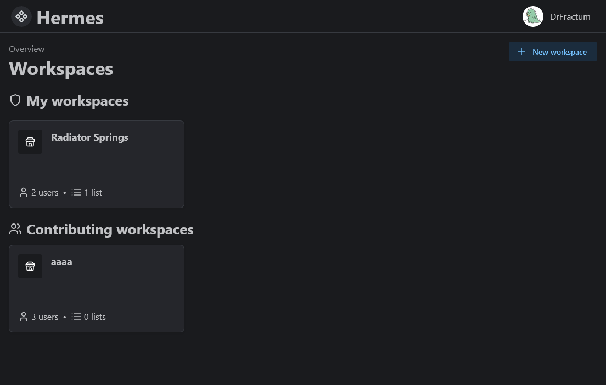

You can have different workspaces for different households. There is a clear distinction between workspaces you own and
workspaces you are a member of.

### Workspace overview

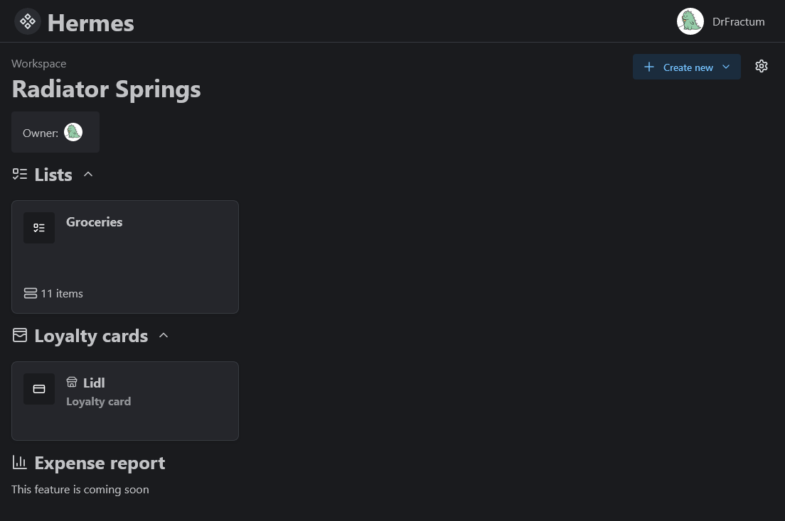

Inside your workspace you can see all of your lists. You can also see your loyalty cards and the members of the
workspace.

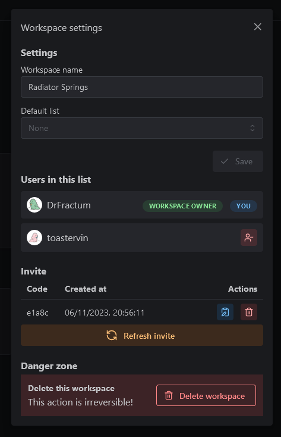

Clicking on the gear icon in the top right opens the workspace settings modal. This is one I'm particularly proud of. It
allows you to change the workspace name, delete it, set a default list, kick collaborators, and copy, delete, and
refresh the invite code.

### Lists

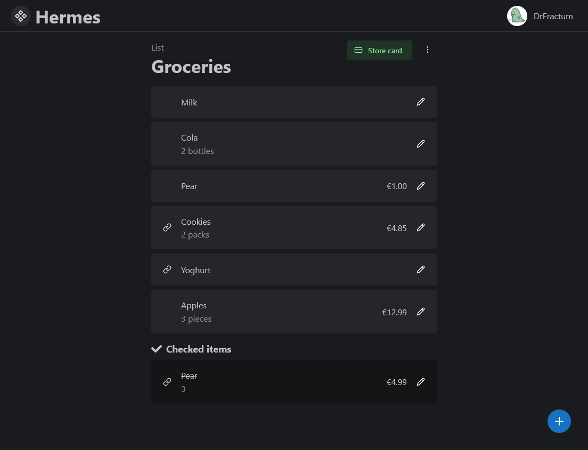

On the list page you can make your shopping list. Items can be added through the FAB (floating action button). This
opens a modal where you can enter the name, price, amount, and URL of the item. URL's can be used to clarify which type
of cookies you mean specifically.

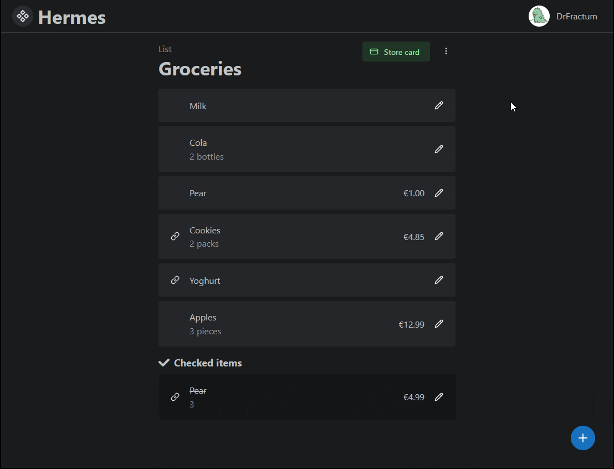

Items can be checked off by swiping. The same thing goes for unchecking and deleting items.

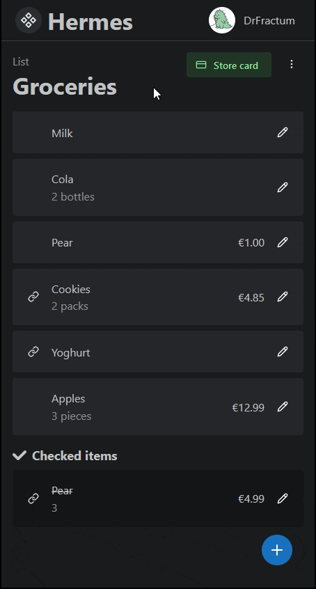

> Featuring mobile-like animations!

The loyalty card button is used to show your default loyalty card for this list. This is useful when you're in the
store, since you don't have to switch to a different app to scan your loyalty card.
The modal can be closed using the browser's (or your phone's) back button (Which took me a whole night to get working
properly).

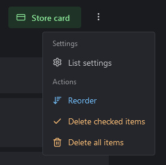

The list menu can be opened by clicking the three dots in the top right. This menu allows you to access the list
settings, delete checked items, and delete all items.

It also allows you to turn on Reordering mode.
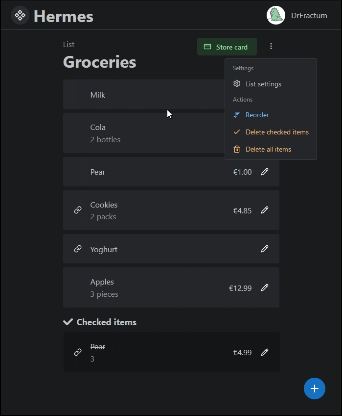

### Invites

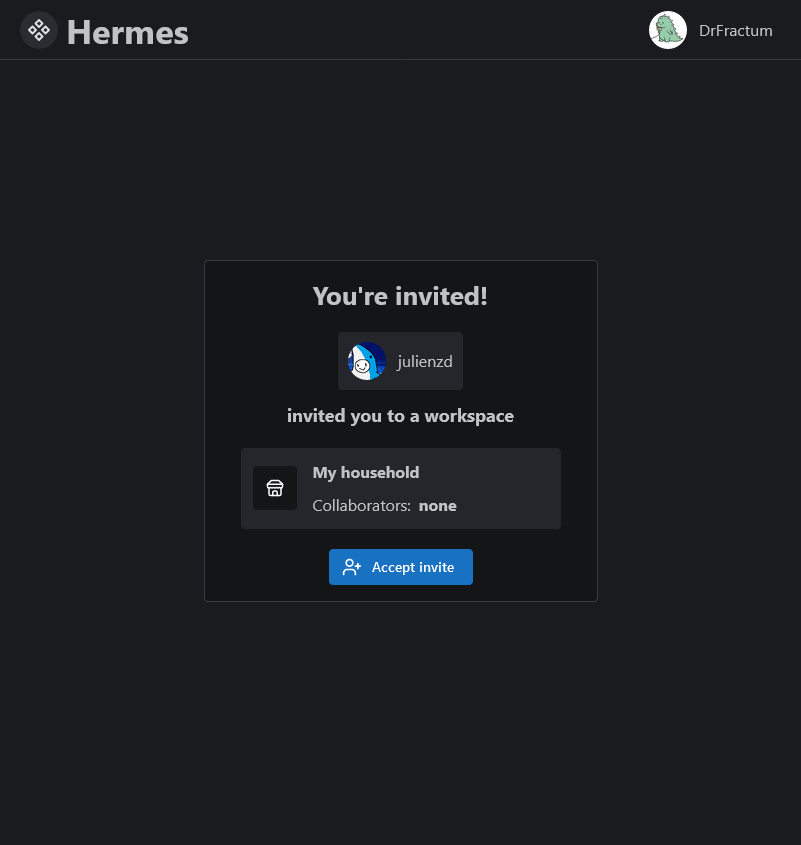

Invites allow other users to join your workspace. The code / link can be found in the workspace settings modal.
Users that click your link are treated with the above screen. Clicking `Accept invite` adds them to the workspace, and
redirects them to the workspace overview.

### Profile

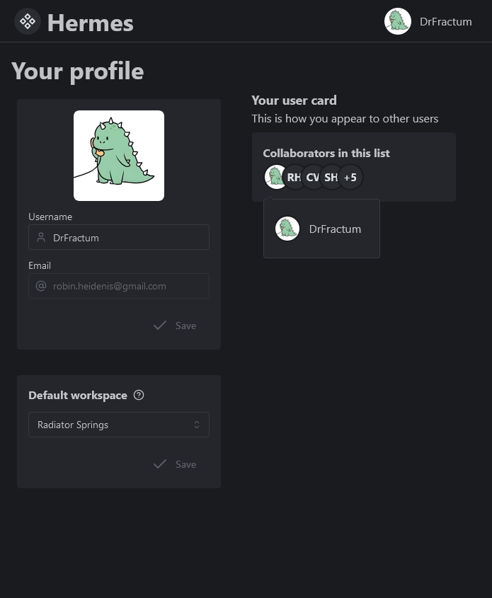

Finally, we have the profile page. This page shows your name, email, and profile picture.
It allows you to change your username (if you've logged in with Discord), and your email (if you signed up with
email/password).
Updating your profile here will also update it in Auth0.

### View transitions

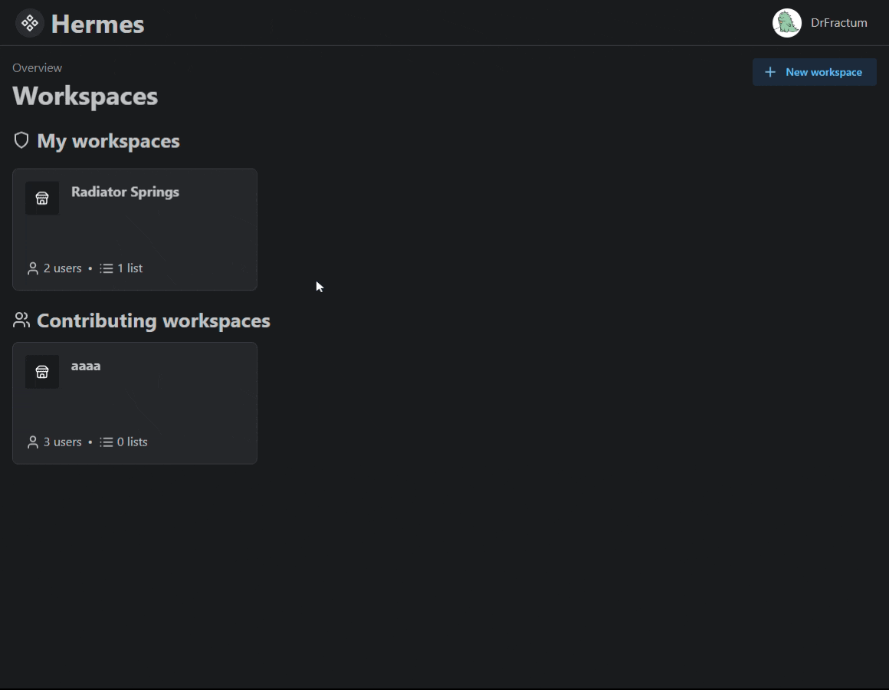

Hermes uses a brand-new API called view transitions to make page transitions look better. It animates a fade from the
previous page to the next page, and animates the movement of certain elements like the workspace title.

> [!Note]
> This currently only works in Google Chrome (and Chromium based browsers like Edge), and not in Firefox.